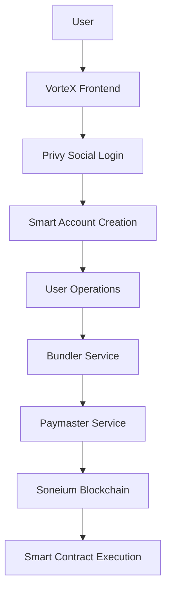

# VorteX Architecture: Blockchain Interaction & User Flow

## 🎯 Core Architecture Principles

### **1. Modular Design Philosophy**
```
VorteX Ecosystem = Independent Modules + Shared Infrastructure

├── Frontend Layer (React Apps)
│   ├── VorteX Core (Navigation Hub)
│   ├── SCS-AA-Demo-UI (Smart Wallet)
│   └── Aliza Forecaster (AI Predictions)
│
├── Shared Infrastructure
│   ├── libs/shared (Types, Constants, Utils)
│   ├── libs/web3-utils (Blockchain Helpers)
│   └── Environment Configuration
│
└── Blockchain Layer (Soneium + Services)
    ├── Smart Contracts (ERC-4337)
    ├── Bundler Service (Transaction Processing)
    └── Paymaster Service (Gas Sponsorship)
```

### **2. Why This Architecture?**
- **Flexibility**: Each module can be developed/deployed independently
- **Maintainability**: Shared code in libs, unique logic in packages
- **Scalability**: Add new modules without breaking existing ones
- **Testing**: Each module can be tested in isolation

---

## 🔗 Blockchain Interaction Flow

### **The Journey: User → Smart Account → Blockchain**



### **Detailed Flow Breakdown:**

#### **Step 1: User Authentication**
```
User clicks "Connect Wallet" 
→ Privy modal opens
→ User chooses Google/Twitter/Email
→ OAuth flow completes
→ Privy creates embedded wallet (EOA)
→ VorteX stores user session
```

#### **Step 2: Smart Account Creation**
```
EOA wallet exists
→ startale-aa-sdk.toStartaleSmartAccount()
→ Generates deterministic smart account address
→ Smart account not deployed yet (counterfactual)
→ First transaction will deploy it
```

#### **Step 3: Transaction Execution**
```
User wants to send transaction
→ Frontend calls smartAccountClient.sendTransaction()
→ UserOperation created (ERC-4337 format)
→ Gas estimation via bundler
→ Paymaster signs for gas sponsorship
→ Bundler submits to EntryPoint contract
→ Smart account executes transaction
```

#### **Step 4: Session Management**
```
User approves AI trading session
→ Session key generated (temporary private key)
→ Session permissions defined (contract, function, limits)
→ Session signed by main account
→ AI can execute trades using session key
→ Session expires after time limit
```

---

## 🧠 Smart Sessions: The Magic Behind Automation

### **What Problem Do Smart Sessions Solve?**

**Without Smart Sessions:**
- User must approve every AI prediction trade manually
- Defeats the purpose of automation
- Poor user experience

**With Smart Sessions:**
- User approves once: "Let AI trade for me (1 hour, max $10)"
- AI can execute trades automatically within limits
- Secure: Time-limited + Scope-limited

### **Technical Implementation:**

```typescript
// 1. Create session key
const sessionKey = generatePrivateKey();
const sessionAccount = privateKeyToAccount(sessionKey);

// 2. Define permissions
const sessionPermissions = {
  target: PREDICTION_CONTRACT_ADDRESS,
  functionSelector: "0x12345678", // executeTrade()
  valueLimit: parseEther("0.01"), // max 0.01 ETH per trade
  callsLimit: 10, // max 10 trades
  validAfter: Math.floor(Date.now() / 1000), // now
  validUntil: Math.floor(Date.now() / 1000) + 3600, // 1 hour
};

// 3. Main account signs session approval
const sessionApproval = await mainAccount.signMessage(sessionPermissions);

// 4. AI uses session key to trade
const tradeTransaction = await sessionAccount.sendTransaction({
  to: PREDICTION_CONTRACT_ADDRESS,
  data: encodeFunctionData({
    abi: PredictionABI,
    functionName: "executeTrade",
    args: [predictionId, amount]
  })
});
```

---

## 🔧 Backend Services & APIs

### **1. Soneium Network (Sony's L2)**
- **Purpose**: Fast, cheap transactions
- **Chain ID**: 1946 (Minato Testnet)
- **Benefits**: EVM compatible + Low fees + High throughput

### **2. Bundler Service**
- **URL**: `https://soneium-minato.bundler.scs.startale.com`
- **Purpose**: Process ERC-4337 UserOperations
- **Flow**: UserOp → Bundler → EntryPoint → Smart Contract

### **3. Paymaster Service**
- **URL**: `https://paymaster.scs.startale.com/v1`
- **Purpose**: Sponsor gas fees for users
- **Policies**: "sudo" policy = unlimited sponsorship (for demo)

### **4. Smart Contracts (Deployed on Soneium)**
```
EntryPoint: 0x0000000071727De22E5E9d8BAf0edAc6f37da032
AccountFactory: 0xF227EB456F1B0AC51b07f451040ec1c44aB8D1aA
SessionModule: 0x716BC27e1b904331C58891cC3AB13889127189a7
RecoveryModule: 0x29c3e3268e36f14A4D1fEe97DD94EF2F60496a2D
```

---

## 👤 User Experience Flow

### **Scenario 1: First-Time User**
1. **Lands on VorteX**: See clean terminal interface
2. **Clicks "Smart Wallet"**: Opens SCS-AA-Demo-UI
3. **Social Login**: Google OAuth → Account created
4. **Smart Account**: Automatically generated, ready to use
5. **Make Prediction**: Navigate to Aliza Forecaster
6. **Enable Auto-Trading**: Create session for AI trading
7. **Sit Back**: AI executes trades based on predictions

### **Scenario 2: Power User**
1. **Direct Module Access**: Bookmark specific module URLs
2. **Multiple Sessions**: Different AIs with different permissions
3. **Portfolio Management**: Cross-module state sharing
4. **Custom Parameters**: Fine-tune AI trading parameters

---

## 🛡️ Security & Trust Model

### **Multi-Layer Security:**

#### **1. Account Abstraction Security**
- Smart accounts use ERC-4337 standard
- No direct private key exposure
- Upgradeable security modules

#### **2. Session Security**
- Time-limited permissions
- Scope-limited actions
- Revocable anytime

#### **3. Infrastructure Security**
- Startale Labs managed services
- Audited smart contracts
- Established bundler/paymaster

### **Trust Assumptions:**
- **Trust Startale**: For bundler/paymaster services
- **Trust Privy**: For social login infrastructure
- **Trust Smart Contracts**: Open source, audited
- **Minimize Trust**: Users control session permissions

---

## 🔄 Data Flow & State Management

### **Cross-Module Communication:**

```
VorteX Core (State Manager)
├── Auth State: User login, smart account address
├── Web3 State: Chain, balance, transaction status
├── Session State: Active sessions, permissions
└── Navigation State: Current module, preferences

Shared Between Modules:
├── User Identity (Privy)
├── Smart Account Address
├── Active Sessions
└── Transaction History
```

### **Implementation:**
- **Zustand**: Global state management
- **URL Parameters**: Pass data between modules
- **LocalStorage**: Persist user preferences
- **Event System**: Real-time updates

---

## 🚀 Development Workflow

### **Adding New Modules:**
1. Create new package in `packages/`
2. Add to workspace in `pnpm-workspace.yaml`
3. Import shared libs from `libs/`
4. Add navigation in VorteX Core
5. Configure environment variables

### **Modifying Blockchain Logic:**
1. Update `libs/web3-utils` for shared functions
2. Package-specific logic stays in package
3. Update smart contract addresses in env
4. Test on Soneium Minato first

### **UI/UX Customization:**
1. Modify `globals.css` for design system
2. Each package can override styles
3. Use terminal design system classes
4. Maintain monospace consistency

---

## 📊 Performance & Optimization

### **Frontend Optimization:**
- **Code Splitting**: Each module loads independently
- **Shared Dependencies**: Common libs cached
- **Lazy Loading**: Modules load on demand

### **Blockchain Optimization:**
- **Gas Estimation**: Automatic via bundler
- **Batch Transactions**: Multiple operations in one UserOp
- **Session Caching**: Avoid repeated session creation

### **User Experience:**
- **Instant Feedback**: Optimistic UI updates
- **Background Sync**: Transaction status updates
- **Error Recovery**: Graceful failure handling

---

## 🎯 Next Phase: Integration Goals

### **Short Term (1-2 weeks):**
1. **Shared State**: Pass auth between modules
2. **Session Demo**: Working AI trading session
3. **Real Data**: Connect to price feeds
4. **Error Handling**: Comprehensive error management

### **Medium Term (1 month):**
1. **Multiple AIs**: Different prediction strategies
2. **Portfolio View**: Cross-module portfolio
3. **Advanced Sessions**: Complex permission trees
4. **Mobile Support**: Responsive design

### **Long Term (3 months):**
1. **Mainnet Deployment**: Production ready
2. **Custom Modules**: Third-party integrations
3. **Advanced Analytics**: Performance tracking
4. **Social Features**: Share strategies

This architecture provides **maximum flexibility** for frontend customization while maintaining **robust backend modularity**. You can completely redesign any module's UI without breaking the core blockchain functionality.
